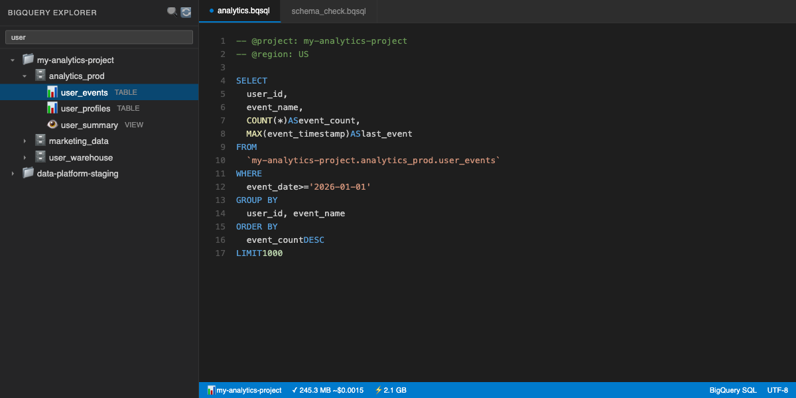
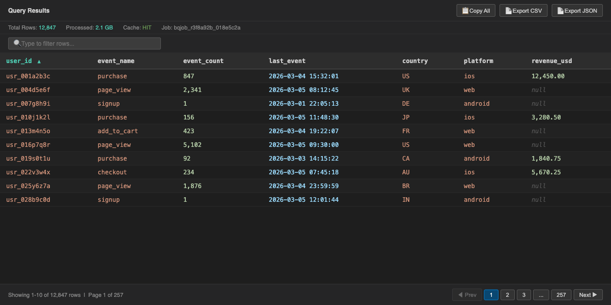
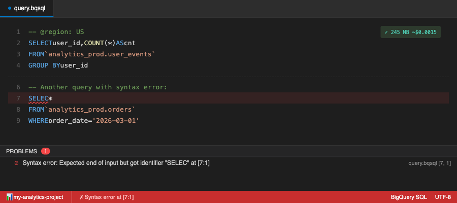
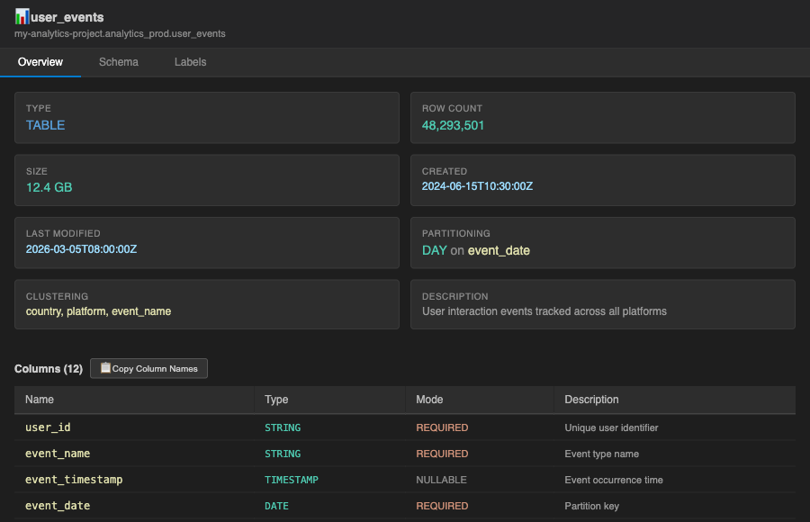
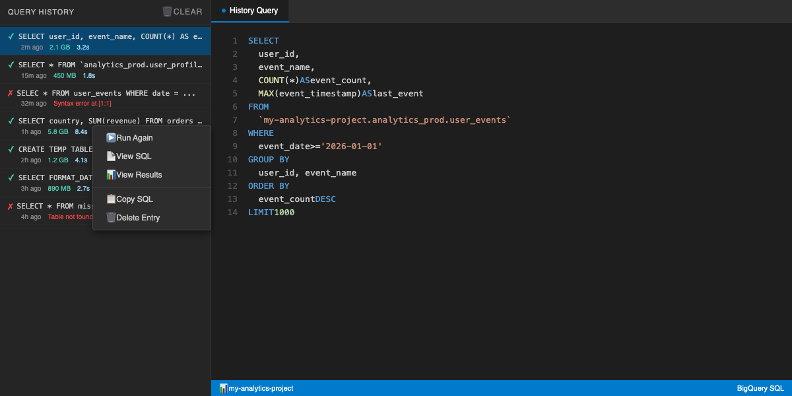

# BigQuery Browser

Browse BigQuery assets, write SQL, and view results — all inside VS Code.

## Features

### Asset Explorer & SQL Editor

Browse projects, datasets, and tables in the sidebar. Filter by name. Write BigQuery SQL with syntax highlighting, per-query project/region directives, and real-time cost estimation.



### Query Results with Paging & Sorting

Paginated results table with column sorting, client-side filtering, and export to CSV/JSON/clipboard. Paging uses free `tabledata.list` API — no query cost for navigation.



### Auto Dry Run & Inline Errors

Real-time cost estimation as you type (1.5s debounce). Syntax errors shown inline in the editor with Problems panel integration, just like a language server.



### Table Metadata & Schema

View table overview (type, rows, size, partitioning, clustering), full schema with column types and descriptions, and labels — all in a tabbed panel.



### Query History

Browse, re-run, and view SQL/results from previous queries. 24h auto-retention. Right-click context menu for quick actions. Cached temp table results viewable without re-running.



### More Features
- **Schema Hover** — Hover over backtick-quoted table refs to see columns
- **SQL Directives** — Per-query overrides: `-- @project:xxx` and `-- @region:xxx`
- **Execution vs Browse Projects** — Separate `executionProjectId` (billing) from `projectId` (browsing)

## Getting Started

1. **Install** the extension from VS Code Marketplace
2. **Authenticate** with Google Cloud:
   - `gcloud auth application-default login` (recommended), OR
   - Set `bigqueryBrowser.keyFilePath` to service account key JSON
3. **Set default project**: `Cmd+Shift+P` → "BigQuery: Select Project"
4. **Open** BigQuery Browser panel from activity bar
5. **Create** `.bqsql` file and write SQL

## Keyboard Shortcuts

| Shortcut | Action |
|----------|--------|
| `Cmd+Enter` | Run Query |
| `Cmd+Shift+Enter` | Dry Run (Estimate Cost) |

## All Commands

| Command | Shortcut | Use |
|---------|----------|-----|
| Run Query | Cmd+Enter | Execute active .bqsql file |
| Dry Run | Cmd+Shift+Enter | Estimate query cost |
| Refresh Explorer | — | Reload projects/datasets/tables |
| Copy Table Reference | — | Copy backtick-quoted table name |
| Preview Data | — | Quick table preview (context menu) |
| View Schema | — | Open table metadata panel |
| Set Default Project | — | Change browsing project |
| Set Execution Project | — | Set query billing project |
| Set Default Region | — | Configure query location |
| Set Max Bytes Billed | — | Set cost limit per query |
| New BigQuery SQL File | — | Create .bqsql file |
| Filter Explorer | — | Filter dataset/table names |
| Clear Explorer Filter | — | Reset asset explorer filter |
| Filter History | — | Filter history by name or SQL |
| Clear History Filter | — | Reset history filter |
| Clear History | — | Delete all query history |
| Run Again | — | Rerun selected history entry |
| View SQL | — | Show SQL from history |
| View Results | — | Show cached results from history |
| Rename Entry | — | Rename history query (context menu) |
| Copy SQL | — | Copy history SQL to clipboard (context menu) |
| Delete Entry | — | Delete history query with confirmation (context menu) |

## Extension Settings

| Setting | Type | Default | Description |
|---------|------|---------|-------------|
| `bigqueryBrowser.projectId` | string | `""` | Default project for browsing datasets/tables |
| `bigqueryBrowser.executionProjectId` | string | `""` | Project for query execution & billing (fallback to projectId) |
| `bigqueryBrowser.keyFilePath` | string | `""` | Path to service account key JSON (empty = use ADC) |
| `bigqueryBrowser.maxResults` | number | `50` | Rows per page (10-1000) |
| `bigqueryBrowser.location` | string | `US` | Default query location |
| `bigqueryBrowser.queryHistoryLimit` | number | `100` | Max history entries (10-500) |
| `bigqueryBrowser.autoDryRun` | boolean | `true` | Auto-estimate cost while typing |

## SQL Directives

Add special comments to override per-query settings:

```sql
-- @project:my-other-project
-- @region:EU

SELECT * FROM my_dataset.my_table LIMIT 10;
```

Supported directives:
- `@project:PROJECT_ID` — Override execution project
- `@region:LOCATION` — Override query location (US, EU, etc.)

## Results & Export

Results webview provides:
- **Paging** — Navigate large result sets (free via API)
- **Sorting** — Click column headers to sort (caches sorted temp table)
- **Filtering** — Client-side filter by column value
- **Export** — CSV, JSON, TSV buttons + copy to clipboard

## Authentication

Priority order:
1. **Application Default Credentials (ADC)** — `gcloud auth application-default login`
2. **Service Account Key** — JSON file path in `keyFilePath` setting
3. **gcloud CLI** — Falls back to `gcloud auth` command

## Requirements

- VS Code ^1.85.0
- Google Cloud project with BigQuery API enabled
- `gcloud` CLI (for ADC) OR service account key JSON
